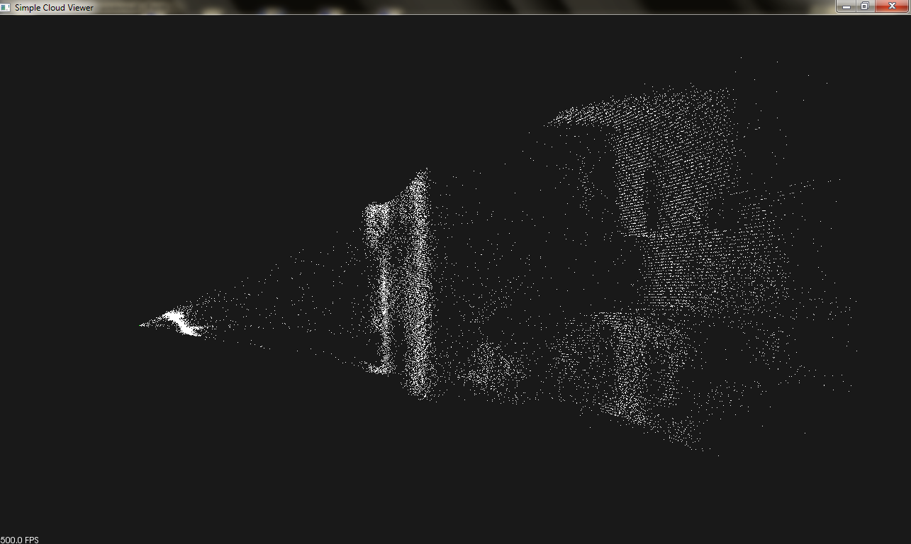

## Verilog/FPGA driver of TOF camera for Blackfin DSP ##

Dmitrii Khizbullin, 2013-2014

TOF (Time-of-Flight) sensor used: PMD Technologies 19k-S3 160x120 [datasheet](https://www.pmdtec.com/html/pdf/pmdPhotonICs_19k_S3.pdf).

An example of a captured point cloud:

